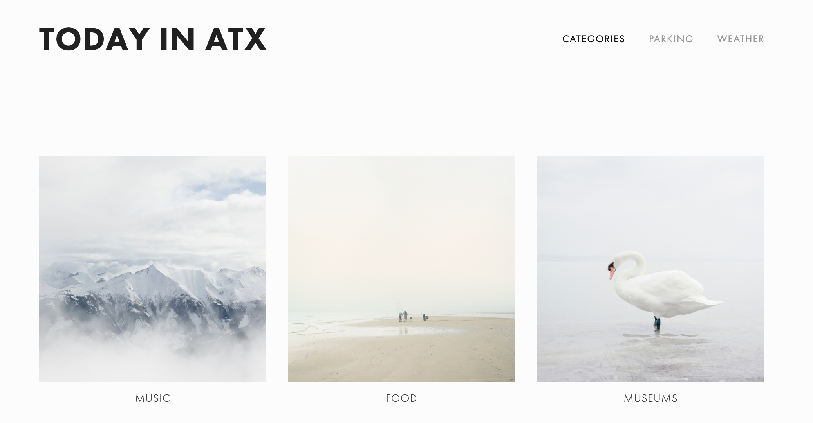
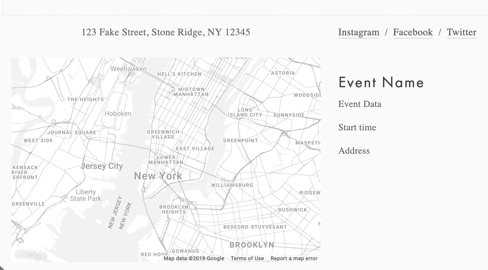
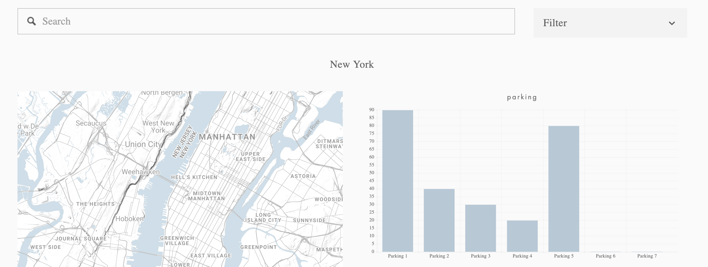
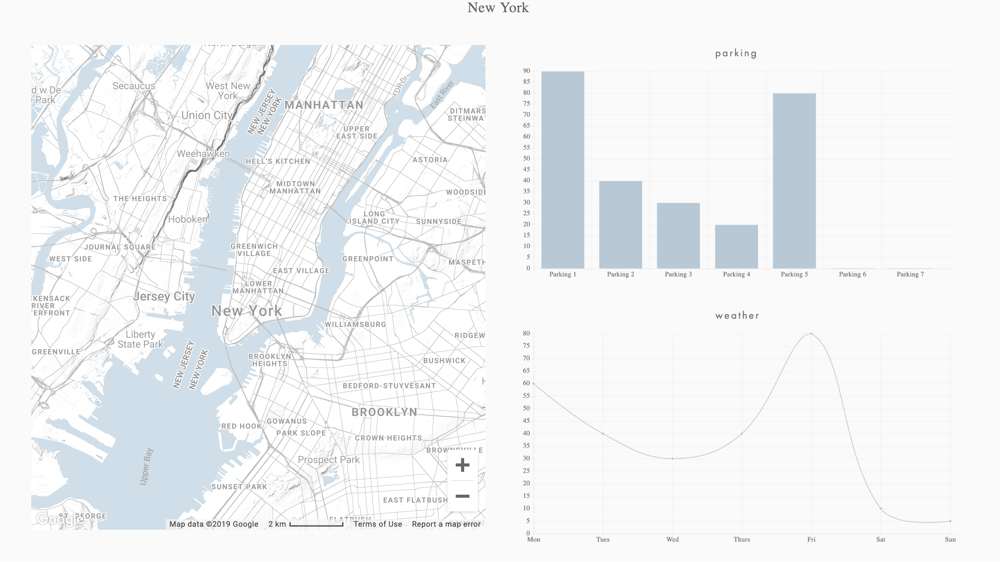
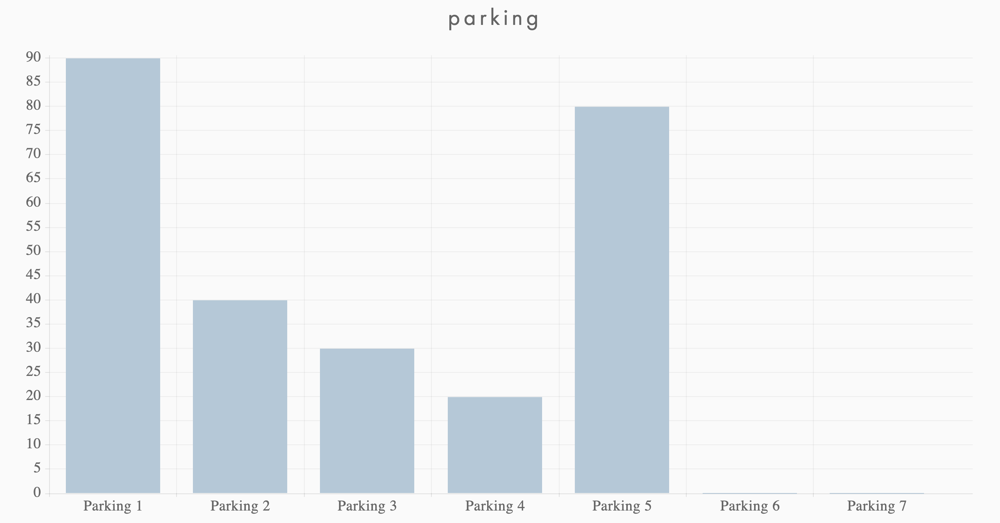
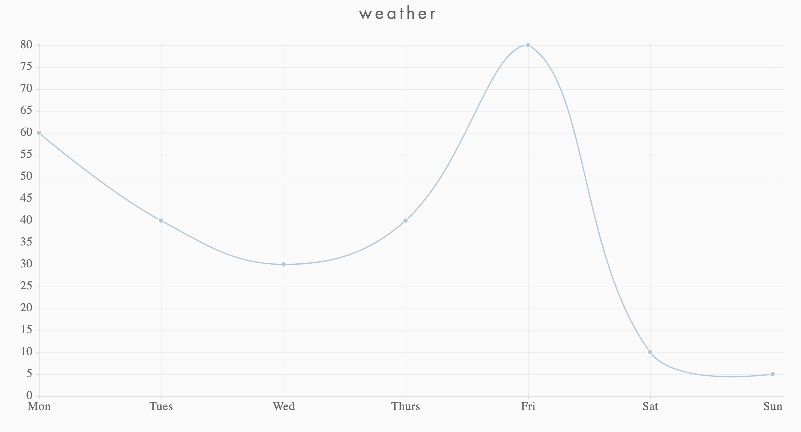

# TODAY IN ATX
#### 1.	VISUALIZATION
- A.	Python Flask powered RESTful API, 
- B.	HTML/CSS, JavaScript, 
- C.	One database (MySQL, MongoDB, SQLite, etc.)
#### 2.	ONE OF THE BELOW FOUR TRACKS: 
- A.	A custom "creative" D3.js project (i.e. non-standard graph or chart)
- B.	A combination of Web Scraping and Leaflet or Plotly
- C.	A dashboard page with multiple charts all updating from the same data
- D.	A "thick" server that performs multiple manipulations on data in a database prior to visualization (must be approved)
#### 3.	YOUR PROJECT SHOULD INCLUDE AT LEAST ONE JS LIBRARY THAT WE DID NOT COVER.
- A.	Multiple.js
- B.	ReactJS
- C.	Slick
- D.	Aurelia
#### 4.	MUST BE POWERED BY A DATASET WITH AT LEAST 100 RECORDS. 
- A. Do512 (event)
- B. parkme (parking)
- C. weather.com (weather)
- D. facebook (number of attendees/popularity of event)
#### 5.	MUST INCLUDE SOME LEVEL OF USER-DRIVEN INTERACTION (E.G. MENUS, DROPDOWNS, TEXTBOXES, ETC.)
- search bar
- filter/dropdown
#### 6.	FINAL VIS MUST HAVE 3 VIEWS

#### HOME LANDING PAGE

#### SINGLE EVENT INFO PAGE

#### PRIMARY DATA PAGE
All maps and charts may be clicked on to enlarge or visit their own webpage. Search for category of event, venue, etc.. Filter by event type, parts of Austin, etc..

